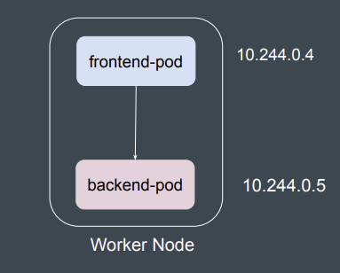

# Kubernetes Ingress

Ingress exposes HTTP and HTTPS routes from outside the cluster to services within the cluster. Traffic routing is controlled by rules defined on the Ingress resource.

An Ingress may be configured to give Services externally-reachable URLs, load balance traffic, terminate SSL / TLS, and offer name based virtual hosting. An Ingress controller is responsible for fulfilling the Ingress, usually with a load balancer, though it may also configure your edge router or additional frontends to help handle the traffic.

## How Ingress Works

1.  **Ingress Resource:** You create a Kubernetes Ingress resource that defines rules for routing external traffic to internal services.
2.  **Ingress Controller:** An Ingress controller is a pod that runs in your cluster and watches for Ingress resources. When it sees one, it configures a load balancer (like NGINX, HAProxy, or a cloud-native load balancer) to implement the rules.
3.  **Traffic Flow:** External traffic hits the load balancer, which then routes it to the appropriate service within the cluster based on the Ingress rules.



## Advantages of Using Ingress

*   **Centralized Access Point:** Ingress provides a single entry point for all external traffic, making it easier to manage and secure your services.
*   **Host and Path-Based Routing:** You can route traffic to different services based on the hostname (e.g., `api.example.com`) or the request path (e.g., `/api`).
*   **SSL/TLS Termination:** Ingress can handle SSL/TLS termination, so you don't have to configure it for each service.
*   **Load Balancing:** Ingress controllers provide load balancing across the pods of a service.
*   **Cost-Effective:** On cloud providers, a single Ingress can be backed by a single load balancer, which is more cost-effective than creating a separate LoadBalancer service for each service you want to expose.

## Disadvantages of Using Ingress

*   **Complexity:** Ingress adds another layer of abstraction, which can make your setup more complex.
*   **Ingress Controller Requirement:** You need to have an Ingress controller running in your cluster, which is an additional component to manage.
*   **Limited to HTTP/HTTPS:** Ingress is primarily designed for HTTP and HTTPS traffic. For other protocols like TCP or UDP, you might need to use a different solution like a `LoadBalancer` or `NodePort` service.

## Demo of an Ingress Controller (NGINX)

This demo shows how to set up a simple Ingress that routes traffic to two different services.

**1. Deploy two simple web applications:**

```yaml
# app1.yaml
apiVersion: apps/v1
kind: Deployment
metadata:
  name: app1-deployment
spec:
  replicas: 2
  selector:
    matchLabels:
      app: app1
  template:
    metadata:
      labels:
        app: app1
    spec:
      containers:
      - name: app1
        image: hashicorp/http-echo
        args:
        - "-text=Hello from App1!"
---
apiVersion: v1
kind: Service
metadata:
  name: app1-service
spec:
  selector:
    app: app1
  ports:
    - protocol: TCP
      port: 80
      targetPort: 5678
```

```yaml
# app2.yaml
apiVersion: apps/v1
kind: Deployment
metadata:
  name: app2-deployment
spec:
  replicas: 2
  selector:
    matchLabels:
      app: app2
  template:
    metadata:
      labels:
        app: app2
    spec:
      containers:
      - name: app2
        image: hashicorp/http-echo
        args:
        - "-text=Hello from App2!"
---
apiVersion: v1
kind: Service
metadata:
  name: app2-service
spec:
  selector:
    app: app2
  ports:
    - protocol: TCP
      port: 80
      targetPort: 5678
```

**2. Deploy the NGINX Ingress Controller:**

You can deploy the NGINX Ingress controller using Helm or by applying the manifest directly from the Kubernetes project.

```bash
kubectl apply -f https://raw.githubusercontent.com/kubernetes/ingress-nginx/controller-v1.1.1/deploy/static/provider/cloud/deploy.yaml
```

**3. Create the Ingress Resource:**

This Ingress resource defines two rules:
*   Traffic to `app1.example.com` is routed to `app1-service`.
*   Traffic to `app2.example.com` is routed to `app2-service`.

```yaml
# ingress.yaml
apiVersion: networking.k8s.io/v1
kind: Ingress
metadata:
  name: example-ingress
spec:
  rules:
  - host: app1.example.com
    http:
      paths:
      - path: /
        pathType: Prefix
        backend:
          service:
            name: app1-service
            port:
              number: 80
  - host: app2.example.com
    http:
      paths:
      - path: /
        pathType: Prefix
        backend:
          service:
            name: app2-service
            port:
              number: 80
```

**4. Test the Ingress:**

To test this, you'll need to get the external IP address of the Ingress controller's service and then modify your local `/etc/hosts` file to point `app1.example.com` and `app2.example.com` to that IP.

```bash
kubectl get service -n ingress-nginx
```

Find the external IP and add it to your `/etc/hosts` file:

```
<EXTERNAL_IP> app1.example.com
<EXTERNAL_IP> app2.example.com
```

Now you can test it:

```bash
curl http://app1.example.com
# Output: Hello from App1!

curl http://app2.example.com
# Output: Hello from App2!
```

## AWS Load Balancer Controller

When running a Kubernetes cluster on AWS, the recommended Ingress controller is the **AWS Load Balancer Controller**. This controller integrates with AWS services to provision and manage Application Load Balancers (ALBs) and Network Load Balancers (NLBs).

### Advantages of AWS Load Balancer Controller:

*   **Native Integration:** It's designed specifically for AWS and integrates seamlessly with ALBs and NLBs.
*   **Advanced Features:** It supports advanced ALB features like routing based on headers, methods, and query parameters, as well as integration with AWS WAF and Cognito.
*   **Cost Savings:** It can manage a single ALB for multiple Ingress resources, which can be more cost-effective than creating a separate load balancer for each.
*   **Direct Pod Targeting:** It can route traffic directly to pods, bypassing the need for a `NodePort` service, which can improve performance and simplify networking.

To use the AWS Load Balancer Controller, you need to install it in your EKS cluster. You can find the installation instructions in the [official AWS documentation](https://docs.aws.amazon.com/eks/latest/userguide/aws-load-balancer-controller.html).
